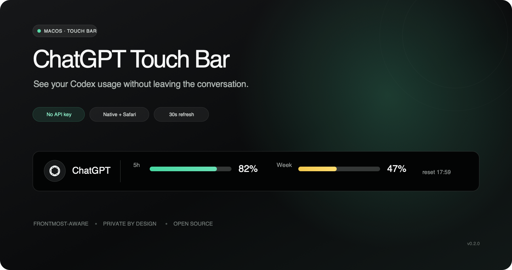
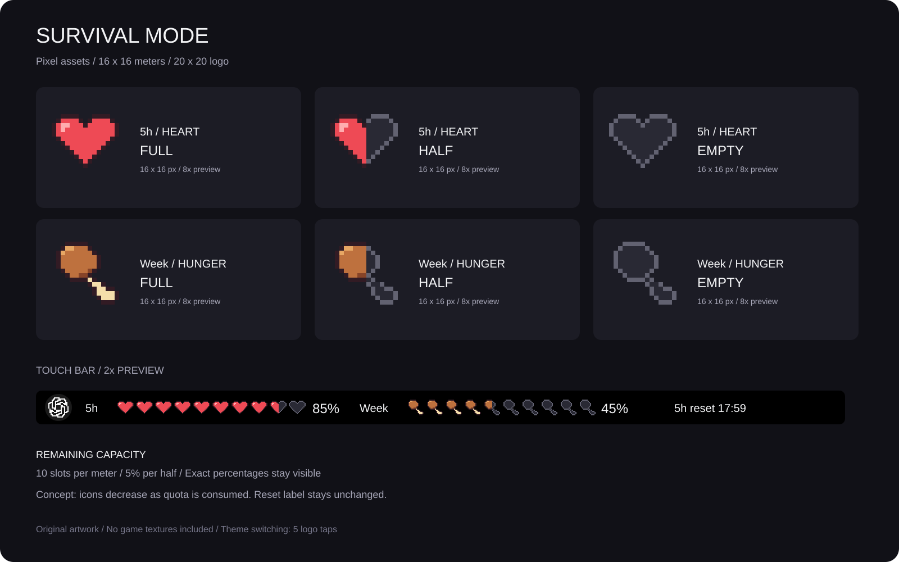

# ChatGPT Touch Bar

[English](README.md) | **日本語**

[](https://github.com/sou1213/chatgpt-touchbar/actions/workflows/ci.yml)
[](LICENSE)
[](#必要環境)
[](#必要環境)



まだTouch Bar付きのMacBookを使っていますか？ キーボードの上のあの場所に、AIの「あとどれくらい使える？」を表示してみました。

ChatGPT/Codexアプリ、またはSafariのChatGPTタブを開いている間、Codexの5時間枠・週次枠の残量とリセット時刻を手元に表示する、非公式のmacOS常駐ヘルパーです。別のアプリやサイトへ移ると、いつものTouch Barに戻ります。

[インストール](#インストール) · [仕組み](#仕組み) · [プライバシー](#プライバシー) · [Figmaデザイン](https://www.figma.com/design/GShJz9Hb4yaNBMlk3zwZNu/ChatGPT-Touch-Bar-OSS-Design?node-id=3-8)

> [!NOTE]
> 表示するのは、ローカルのCodexアカウントから取得したCodex/Workの利用枠です。通常のChatGPTチャットモデルすべての利用上限を表示するものではありません。

## 目次

- [スクリーンショット](#スクリーンショット)
- [特徴](#特徴)
- [サバイバルモード](#サバイバルモード--aiの残量が体力に見えてくる)
- [必要環境](#必要環境)
- [インストール](#インストール)
- [使い方](#使い方)
- [仕組み](#仕組み)
- [設定](#設定)
- [トラブルシューティング](#トラブルシューティング)
- [開発](#開発)
- [プライバシー](#プライバシー)
- [ライセンス](#ライセンス)

## スクリーンショット

Safariで`chatgpt.com`を最前面にした状態です。画像はv0.2.0のもので、現在のバージョンではアイコンとラベルの視認性を改善しています。


## 特徴

- 5時間枠と週次枠の残量を表示します。
- 次のリセット時刻を確認できます。
- 30秒ごと、およびChatGPTへ切り替えた直後に更新します。
- ChatGPT/Codexデスクトップアプリと、Safariの`chatgpt.com`・`chat.openai.com`に対応します。
- 対応画面を開いている間だけSafariのTouch Barを置き換え、離れると標準表示へ戻します。
- 既存のCodex認証を利用するため、APIキーや有料の開発者APIは必要ありません。
- ハートと空腹ゲージで残量を表示する「サバイバルモード」を搭載しています。

## サバイバルモード — AIの残量が、体力に見えてくる。

残り23%。数字だけなら、まだいけそう。

でも、ハートが残りわずかだと、次のお願いはちょっと慎重になる。

5時間の残量はハートに、1週間の残量は空腹ゲージに。OpenAIのロゴまでドット絵になる、マイクラ風の「サバイバルモード」を仕込みました。AIを使うほどハートと骨付き肉が減っていく、ちょっと落ち着かないTouch Barです。

入り口は隠しコマンド。**ロゴを3秒以内に5回タップ。**



「あと一回だけ頼むか、リセットまで休憩するか」。そんな判断が、少しゲームっぽくなります。残量の％とリセット時刻も表示されるので、数字でも確認できます。

いつもの表示に戻すときも、ロゴを3秒以内に5回タップします。選んだモードは、アプリを再起動しても保存されます。

<details>
<summary>ゲージの読み方</summary>

- ハート10個で5時間枠、骨付き肉10個で週次枠の残量を表します。
- 1個が10%、半個が5%。ドット絵の端数は切り捨て、横の数値は1%単位に四捨五入して表示します。
- 薄い空のゲージと「—」は、読み込み中または取得できない状態です。残量ゼロという意味ではありません。
- ゲージの場所を確保するため、このモードではロゴ横の「ChatGPT」の文字を非表示にします。

</details>

ドット絵の編集用SVGは[`design/pixel/`](design/pixel/)にあります。ゲーム本体のテクスチャは使用していません。OpenAIロゴはOpenAIの商標です。

## 必要環境

- Touch Bar付きのMacBook Pro
- macOS 12 Monterey以降
- Swift 5.9以降とXcode Command Line Tools
- ログイン済みのChatGPT、Codex、またはCodex CLI
- Web版を検出する場合はSafari（ほかのブラウザには未対応）

## インストール

現在は署名済みバイナリを配布していないため、ソースコードからビルドします。

```bash
git clone https://github.com/sou1213/chatgpt-touchbar.git
cd chatgpt-touchbar
swift test
./scripts/build_app.sh
open dist/ChatGPTTouchBar.app
```

生成されるアプリはアドホック署名され、Dockには表示されません。常用する場合は、Finderで`dist/ChatGPTTouchBar.app`を「アプリケーション」フォルダへコピーして起動し、「システム設定 → 一般 → ログイン項目」へ追加してください。macOS Montereyでは「システム環境設定 → ユーザとグループ」にあります。

`swift`が見つからない場合は、`xcode-select --install`でCommand Line Toolsをインストールしてください。`swift --version`で5.9以降になっていることを確認します。

### 更新とアンインストール

更新するときは`git pull --ff-only`の後に`./scripts/build_app.sh`を実行します。起動中のヘルパーを終了してから、インストール済みのアプリを新しいビルドへ入れ替えて起動してください。

終了するには、アクティビティモニタを使うか、次のコマンドを実行します。

```bash
pkill -x ChatGPTTouchBar
```

アンインストールするときは、ヘルパーを終了してログイン項目から外し、`ChatGPTTouchBar.app`をゴミ箱へ移動します。ChatGPT/Codexのアカウントや認証には影響しません。

## Safariを初めて使うとき

初回の検出時に、ChatGPT Touch BarがSafariを操作することを許可するかmacOSから確認されます。現在のタブURLを取得するために許可してください。

拒否した場合は「システム設定 → プライバシーとセキュリティ → オートメーション」から後で変更できます。

読み取るのは現在のSafariタブのURLだけです。画面、ページ本文、Cookie、メッセージ、入力内容は取得しません。

## 使い方

1. `ChatGPTTouchBar.app`を起動します。
2. ChatGPT/Codexデスクトップアプリを最前面にするか、Safariのアクティブなタブで`chatgpt.com`を開きます。
3. Touch Barが使用量表示へ切り替わります。別の画面へ移ると標準のTouch Barへ戻ります。

UIを表示せずデータ取得だけを確認する場合は、次のコマンドを実行します。

```bash
swift run ChatGPTTouchBar --once-json
```

## 仕組み

ローカルで`codex app-server`を起動し、`account/rateLimits/read`を呼び出します。取得した使用率を残量へ変換し、2本のコンパクトなメーターとして`NSTouchBar`へ描画します。

最前面アプリの検出には`NSWorkspace`を使用します。SafariではAppleScriptで現在のタブURLだけを読み、許可したホスト名と照合します。

App Serverの仕様は[Codex App Server公式ドキュメント](https://learn.chatgpt.com/docs/app-server#6-rate-limits-chatgpt)を参照してください。

## 設定

アプリ起動前に次の環境変数を設定できます。

| 変数 | 用途 |
| --- | --- |
| `CHATGPT_TOUCHBAR_CODEX_BINARY` | `codex`実行ファイルの絶対パス |
| `CHATGPT_TOUCHBAR_TARGET_APPS` | 対象アプリ名またはBundle IDのカンマ区切りリスト |
| `CHATGPT_TOUCHBAR_TARGET_WEB_HOSTS` | 対象となるSafariホスト名のカンマ区切りリスト |

```bash
CHATGPT_TOUCHBAR_TARGET_WEB_HOSTS="chatgpt.com,chat.openai.com" \
  ./dist/ChatGPTTouchBar.app/Contents/MacOS/ChatGPTTouchBar
```

既存のプロセスを終了してから実行してください。Finderからの起動ではシェルの環境変数を引き継がないため、この例ではアプリ内の実行ファイルを直接起動しています。対象アプリやホスト名を変更しても、別のAIプロバイダーへの対応やアカウント切り替えにはなりません。

## トラブルシューティング

| 症状 | 確認すること |
| --- | --- |
| Dockアイコンやウインドウがない | バックグラウンドヘルパーのため正常です。ChatGPTまたは対応するSafariタブを最前面にしてください。 |
| Safariの通常表示から変わらない | オートメーション権限と、アクティブなタブのホスト名を確認してください。 |
| `codex not found` | ChatGPT/CodexまたはCodex CLIをインストールするか、`CHATGPT_TOUCHBAR_CODEX_BINARY`を設定してください。 |
| `usage unavailable` | `swift run ChatGPTTouchBar --once-json`を実行し、ローカルのCodexアカウントで使用量を取得できるか確認してください。 |
| ブラウザのアカウントと数字が違う | 表示するのはローカルCodex側のデータです。Safariで別のアカウントへログインしてもデータ元は変わりません。 |

Issueを作成するときは、Macの機種、macOSのバージョン、エラーメッセージを記載してください。ログからアカウント情報などの個人情報を除いてください。

## 開発

```bash
swift test
swift run ChatGPTTouchBar --once-json
./scripts/build_app.sh
```

README画像の編集用SVGは[`design/readme-hero.svg`](design/readme-hero.svg)にあります。初期のレイアウト案を含むデザイン素材は[`design/`](design/)にあります。

コントリビューションを歓迎します。詳しくは[`CONTRIBUTING.md`](CONTRIBUTING.md)を参照してください。

## プライバシー

- 使用量は、既存アカウントで認証されたローカルのCodexプロセスから取得します。
- アナリティクス、テレメトリー、リモートデータベース、第三者サーバーは含みません。
- Safari連携で読み取るのはアクティブなタブのURLだけです。
- APIキーの入力や保存は行いません。

## 制限事項

- システムモーダルとしてTouch Barを表示するために、macOSの非公開セレクタを使用しています。Mac App Storeでの配布には適さず、macOSの更新後に動作しなくなる可能性があります。
- 対応ブラウザはSafariのみです。
- Touch Barを搭載していないMacでは、実機表示を確認できません。
- このプロジェクトは非公式であり、OpenAIによる承認・提携を受けたものではありません。ChatGPT、Codex、OpenAIロゴは各権利者の商標です。

## ライセンス

[MIT License](LICENSE)で公開しています。

システムモーダルでTouch Barを表示する実装は、Daytimeflowの`codex-touchbar-usage`を参考にしています。MITライセンス表記は[`LICENSES/Daytimeflow-codex-touchbar-usage.txt`](LICENSES/Daytimeflow-codex-touchbar-usage.txt)に保存しています。
